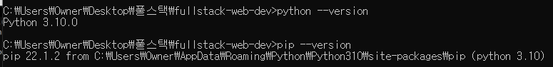

# 2.4 필요한 소프트웨어

## 필요한 도구
- 코드 편집기
- 터미널 또는 `GitBash`와 같은 명령줄 인터페이스(`CLI`)
- 파이썬 버전 3.7 이상 및 파이썬 패키지 관리자 `pip`
- 웹 브라우저

<br />

## 1. 코드 편집기
- **추천:** [Visual Studio Code (VS Code)](https://code.visualstudio.com/)  
- 다른 옵션: [Sublime Text](https://www.sublimetext.com/), [Atom](https://atom.io/), [Vim](https://www.vim.org/)

<br />

## 2. 명령줄 인터페이스(`CLI`)
강좌에서는 `Linux` 및 `Git` 명령어를 사용하므로 `CLI` 준비가 필요하다.

### a. Linux / Mac 사용자
- **기본 터미널 사용 가능 (내장 `CLI`가 있음)**
  - `Linux` : 터미네이터
  - `Mac` : 터미널
- 이 `CLI`는 대부분 `Linux`와 `Git` 명령을 지원. `CLI` 별도 설치 불필요

### b. Windows 사용자
- Windows의 기본 `CLI`는 `CMD`(명령 프롬프트)
- **`CMD`는 `Git/Linux` 명령 미지원 → `Git Bash` 설치 필요**
- 설치 방법:
  1. [Windows용 Git](https://git-scm.com/download/win) 다운로드 및 설치
  2. 설치 시 기본 옵션 사용
  3. 설치 후 `Git Bash` 실행 가능

### c. 쉘 워크샵 [선택 사항]
- 기초 명령어 `cd`, `pwd`, `ls` 등이 익숙하지 않다면   무료 강좌 **셸 워크샵**을 참고하기.  
→ `CLI` 설치 및 기본 명령어 학습 가능

<br />

## 3. 파이썬 버전 3.7 이상 및 파이썬 패키지 관리자 `pip`
- 사용 중인 OS에 맞는 최신 파이썬을 다운로드하여 설치
- 최신 파이썬은 `pip`가 함께 설치되어 있음
- [공식 다운로드](https://www.python.org/downloads/)
- `pip`는 파이썬 [패키지 인덱스](https://pypi.org/)(PyPI)에서 필요한 특정 파이썬 패키지를 설치하는데 사용됨

### 참고 - Windows 사용자
파이썬 설치 후, **`Path` 환경 변수**가 올바르게 설정되어 있는지 확인:
- Python 인터프리터:  
 `C:\Users\<usernameAppData\Local\Programs\Python\Python38`
- pip 스크립트:  
  `C:\Users\<username>\AppData\Local\Programs\Python\Python38\Scripts`

### 설치 확인 명령어

터미널 또는 Git Bash에서 실행:

```bash
python --version
pip --version
```

- Windows CMD/Git Bash에서 파이썬 버전을 확인


- 같은 PC에 Python 2 & 3이 모두 설치되어 있다면 아래 명령으로 확인:
  ```bash
  python3 --version
  pip3 --version
  ```

<br />

## 4. 웹 브라우저
- 수업 중에 작업하는 웹 페이지를 미리 보려면 [`Chrome`](https://www.google.com/chrome/) 또는 [`Firefox`](https://www.firefox.com/en-US/?redirect_source=mozilla-org&utm_campaign=SET_DEFAULT_BROWSER)와 같은 웹 브라우저가 있어야 한다.