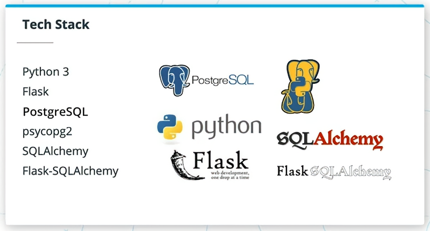

# 2.3 전제 조건 및 기술 스택

## 강좌에 필요한 기술
- 파이썬 기본 프로그래밍
- 프론트엔드 웹 개발 (HTML, CSS, Javascript)
- 터미널 명령 기초
- SQL 및 관계형 데이터베이스

 

### 무료 복습 강좌 추천
- [파이썬 프로그래밍 입문](https://www.udacity.com/org/puroomnet/course/introduction-to-python--ud1110)
- 셸(명령줄) 워크샵
- [Linux 명령줄 기초](https://www.udacity.com/org/puroomnet/course/intro-to-programming-nanodegree--nd000)
- [SQL을 통한 데이터 분석](https://www.udacity.com/org/puroomnet/course/sql-for-data-analysis--ud198)
- [관계형 데이터베이스 소개](https://www.udacity.com/org/puroomnet/course/intro-to-relational-databases--ud197)

 

## 앞으로 다루게 될 기술 스택

- Python 3
- Flask
- PostgresSQL
- psycopg2
- SQLAlchemy
- Flask-SQLAlchemy

 

## 비기술적 전제 조건
강좌를 즐겁고 성공적으로 마치기 위해 고려해야 할 사항들:
- 올바른 기대치 설정하기
- 시간 확보하기
- 능동적인 학습을 위한 전략

 

### 올바른 기대치 설정하기
- 풀스택 개발 개념을 처음 접할 수 있음 → 설렘과 동시에 많은 학습 필요
- 소프트웨어 엔지니어가 되는 과정은 **끊임없는 학습**의 연속
- 중요한 것은 모든 것을 배우는 것이 아니라 **다음에 배울 것의 범위를 명확히** 하는 것
- 애플리케이션을 구축할 때 필요한 것만 학습 → 점차 확장해 나가기
- 모든 것을 다 알지 못해도 괜찮음 → **성장 마인드**가 핵심
- 첫 웹 애플리케이션을 처음부터 끝까지 구축할 수 있도록 리소스 제공

 

### 시간 확보하기
- 정기적으로 학습할 시간과 장소를 확보하는 것이 중요
- 예상보다 더 많은 시간을 학습에 투자할 수 있도록 계획
- **방해 요소 최소화** → 집중할 수 있는 환경 조성

 

### 능동적 학습 전략
- Udacity 멘토 및 다른 수강생과 적극 소통
- 무료 리소스 활용: [interviewing.io](https://interviewing.io), [leetcode](https://leetcode.com)
- Udacity 보충 강좌로 학습 공백 메우기

**이 강좌에서 자세히 다루지 않는 내용**
- HTML, CSS, Javascript (기초만 다룸)
- 애플리케이션 패턴
- 알고리즘 및 데이터 구조

 

### 자기 주도 학습 팁
- 학습 목표가 비슷한 사람들과 교류 → **책임감 부여**
- 다양한 리소스 활용 + 균형 잡힌 학습
- **포모도로 기법** 등으로 휴식 병행
- 커피숍·도서관 등 집중할 수 있는 공간 활용
- 충분한 수면, 꾸준한 운동으로 좋은 컨디션 유지
