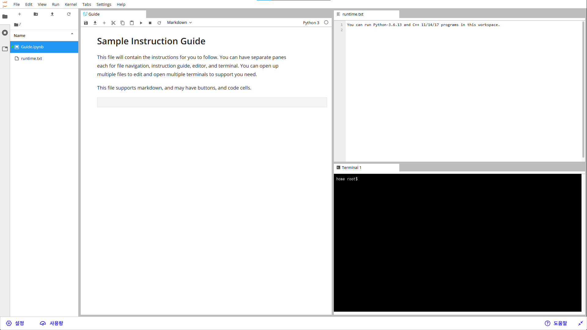

# 2.5 uLab 워크스페이스 개요

## uLab 워크스페이스

- 각 워크스페이스는 클라우드 어딘가에서 사용자만을 위해 실행되는 충분한 컴퓨팅 리소스를 갖춘 `Linux 버추얼 머신`이다.
- 워크스페이스를 가장 잘 지원하는 브라우저는 `Google Chrome`으로, 다른 브라우저에서는 제대로 로드되지 않을 수 있다.

 

## uLab 워크스페이스의 특징
연결이 끊기거나 브라우저 창이 닫힌 경우, 강의실로 돌아와서 워크스페이스 페이지를 다시 열면 워크스페이스 세션은 종료되기 전 상태와 똑같이 유지된다.
일정 시간 동안 활동이 없는 경우, 워크스페이스 세션은 자동으로 종료된다.

### 1. 가이드 탐색
- `Guide.ipynb` 노트북을 열어 워크스페이스 기능을 둘러본다.
- 우측 하단 드롭다운 메뉴로 페이지 이동 가능

### 2. 파일 편집
- 파일을 **더블 클릭**하면 편집기 창에서 열림
- 새로운 파일 추가 가능
- 저장 방법:
  - **Ctrl + S** (단축키)
  - 메뉴 → `File > Save`
- 모든 파일은 **`/home/workspace/`** 디렉터리에 저장해야 유지됨

### 3. 터미널 열기
- 여러 개의 터미널 창을 열 수 있음
- 창을 드래그해서 보기 좋게 배치 가능

### 4. 파일 업로드/다운로드/삭제
- 파일을 **마우스 우클릭** → 옵션 선택
- 연습 삼아 업로드/다운로드 해보기 추천
- 문제 발생 시:
  - **백업 복원** 또는
  - **워크스페이스 리셋**으로 초기화 가능

 

## 저장 및 용량 관리
- **필수:** 모든 파일은 `/home/workspace/`에 저장  
  → 다른 디렉터리에 저장 시 재부팅 후 **삭제됨**
- **저장 용량 제한:**
  - `/home/workspace/` 전체 크기 **3GiB 이하 유지**
  - 개별 파일 **1.5GB 이하**
- 대용량 로그/체크포인트 파일은 `/opt/`에 저장 가능  
  (단, 세션 유휴 시 삭제됨)

 

## 워크스페이스 메뉴 옵션 (왼쪽 하단)
### 1. 새로 고침 (Refresh Workspace)
- 현재 VM을 종료하고 **새로운 VM을 인스턴스화**
- `/home/workspace/`의 모든 파일은 그대로 유지됨
- 문제 해결 시 가장 먼저 시도할 것

### 2. 리셋 (Reset Workspace)
- 워크스페이스를 **완전히 초기 상태로 복원**
- 모든 사용자 코드/파일 **삭제**
- 시작 파일만 있는 새로운 VM으로 교체
- 여러 페이지에서 공유되는 워크스페이스라면 다른 페이지의 코드도 함께 리셋됨

> ⚠️ **주의:** 리셋 시 백업 생성하지 않음 → 작업물 완전히 사라짐

### 3. 자동 백업
VM이 종료되거나 갱신될 때 `/home/workspace/` 자동 백업 → 새 VM에서 자동 복원  
다음 경우에 백업이 발생:
- 세션 만료 후 30분 이상 지난 뒤 복귀
- 명시적 새로 고침
- GPU 토글 시 (GPU 모드 변경)
- (단, **리셋은 백업 생성 안 함**)

### 4. 백업 파일 복원
- `/home/workspace/` 이외의 다른 디렉터리는 백업하지 않음.
필요한 경우 왼쪽 하단 Menu 옵션에서 수동으로 백업 파일을 복원할 수 있다.
- `/home/backups/` 디렉터리에 파일을 다운로드하고, 여기서 원하는 파일을 `/home/workspace/` 디렉터리로 복사할 수 있다.

