# 2.3.11 PostgreSQL 설치 (Windows 기준)

## 1. PostgreSQL 설치하기

###  개요
PostgreSQL(이하 Postgres)은 오픈소스 관계형 데이터베이스 관리 시스템(RDBMS)으로,  
많은 기업과 개발자들이 **웹 애플리케이션의 기본 데이터베이스**로 사용하고 있다.  
이 강의에서는 Postgres를 기반으로 SQL 및 데이터 모델링을 실습한다.

<br>

## 2. 설치 단계 (Windows)

### 1) 설치 파일 다운로드
- [PostgreSQL 공식 다운로드 페이지](https://www.postgresql.org/download/windows/)로 이동한다.
- "**Download the installer**" 버튼을 클릭한다.
- EnterpriseDB(EDB) 인스톨러가 열리면,  
  Windows용 최신 버전(PostgreSQL 16 이상)을 다운로드한다.
  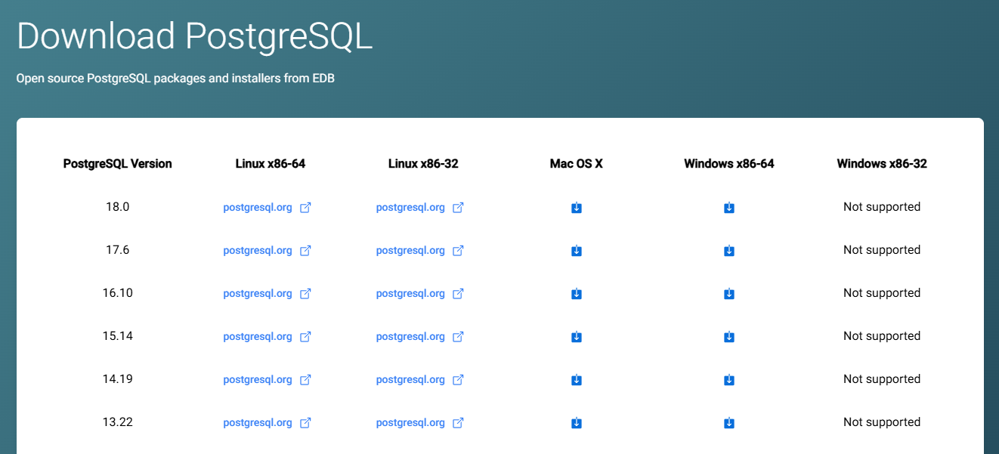

---

### 2) 설치 마법사 실행
다운로드한 `.exe` 파일을 실행하고 아래 순서로 진행한다.

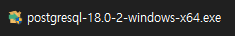

| 단계 | 설정 내용 | 이미지 |
|------|------------|----|
| **1. Installation Directory** | Postgres를 설치할 경로 선택 (기본값 권장)<br>C:\Program Files\PostgreSQL\18 | 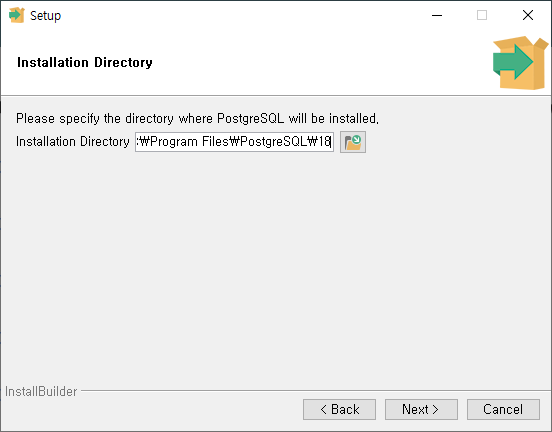 |
| **2. Components** | PostgreSQL Server, pgAdmin 4, <br>Command Line Tools 선택 (기본 선택 유지) | 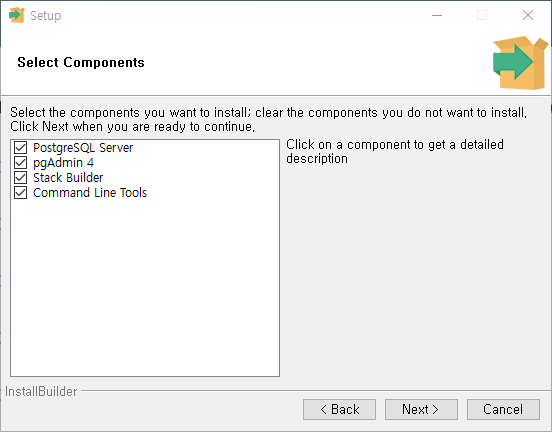 |
| **3. Data Directory** | 데이터베이스가 저장될 경로 설정 (기본값 사용 가능)<br>C:\Program Files\PostgreSQL\18\data | 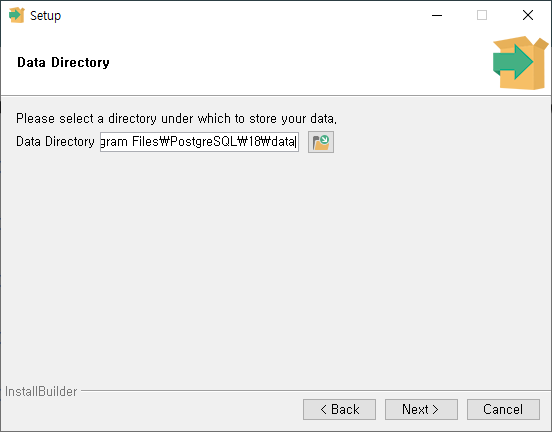 |
| **4. Password** | 기본 사용자(postgres)의 비밀번호 설정 — 잊지 않도록 기록해두세요. | 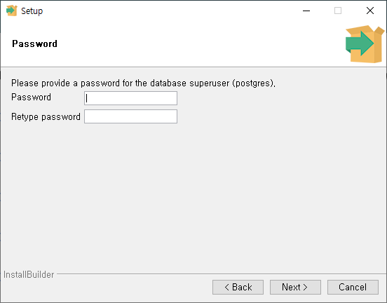 |
| **5. Port** | 기본 포트 **5432** 유지 | 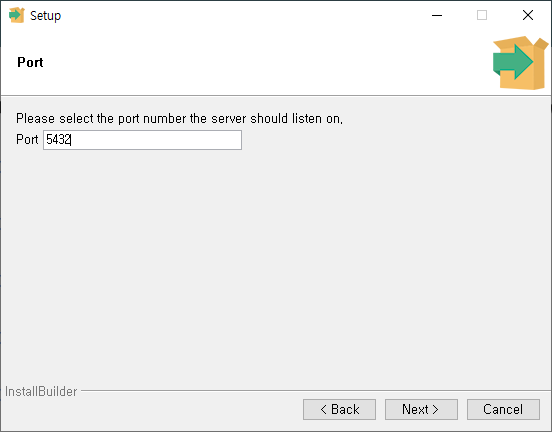 |
| **6. Locale** | 기본값 “Korean, Korea” 또는 “English, United States” 선택 | 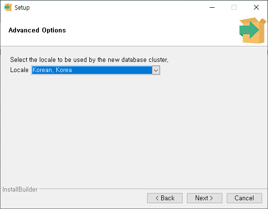 |
| **7. 설치 완료** | 설치 완료 후 “Stack Builder 실행”은 체크 해제 가능 | 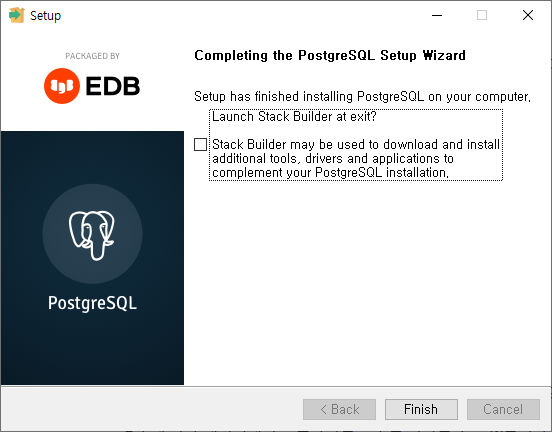 |

---

### 3) 설치 확인
설치 후, 터미널(또는 PowerShell)을 열고 아래 명령어를 입력한다.

```bash
> psql --version
```

출력 예시:
```scss
// 출력 안나오면 환경 변수(PATH) 등록해야 함
psql (PostgreSQL) 18.0
```
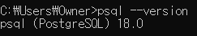

아래 명령어로 Postgres 실행 파일 경로를 확인할 수도 있다:
```bash
> where psql
```

예시 출력:
```makefile
C:\Program Files\PostgreSQL\18\bin\psql.exe
```
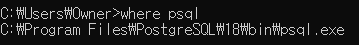

<br>

## 3. PostgreSQL 서버 실행 및 접속
### 방법 1: pgAdmin GUI 사용

설치 시 자동으로 함께 설치된 pgAdmin 4를 실행한다.
- Server Name: PostgreSQL 18 (기본)
- Host: `localhost`
- Port: `5432`
- Username: `postgres`
- Password: (설치 시 입력한 비밀번호)

GUI 환경에서 데이터베이스 생성 및 테이블 관리 가능.
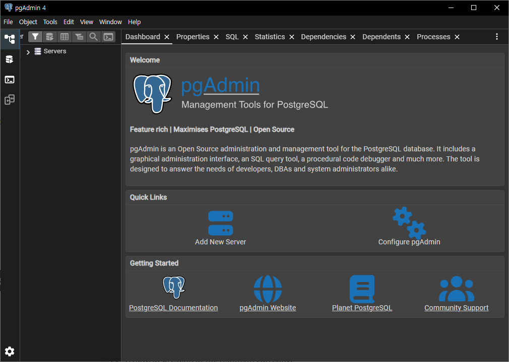

### 방법 2: psql (CLI) 사용

명령 프롬프트에서 다음 명령어를 입력하여 Postgres에 접속한다.
```bash
> psql -U postgres
```

비밀번호 입력 후 아래와 같은 프롬프트가 나오면 성공이다:
```bash
postgres=#
```
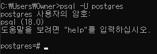

<br>

## 4. 기본 명령어 정리
| 명령어	| 설명 |
|---|---|
| `\l`	| 서버 내 모든 데이터베이스 목록 보기 |
| `\c <dbname>`	| 특정 데이터베이스로 전환 |
| `\dt`	| 현재 DB의 테이블 목록 보기 |
| `\d <tablename>`	| 특정 테이블의 구조 확인 |
| `\q`	| psql 종료 |

<br>

## 5. 데이터베이스 관리 명령어
| 명령어	| 설명 |
|---|---|
| `createdb <dbname>`	| 새 데이터베이스 생성 |
| `dropdb <dbname>`	| 데이터베이스 삭제 |
| `dropdb <dbname> && createdb <dbname>`	| 데이터베이스 초기화 (리셋) |
| `psql <dbname> [<username>]`	| 특정 데이터베이스에 접속 |

<br>

## 6. 초기 설치 시 자동 구성 요소
| 항목	| 설명	|
|---|---|
| 기본 사용자	| `postgres`	|
| 기본 데이터베이스	| `postgres`	|
| 템플릿 DB	| `template0`, `template1` (새 DB 생성 시 복제본으로 사용)	|
| 기본 호스트	| `localhost (127.0.0.1)`	|
| 기본 포트	| `5432`	|
| 기본 비밀번호	| (설치 시 직접 지정)	|


<br>

## 7. PostgreSQL 기본 개념
| 개념	| 설명	|
|---|---|
| 객체 관계형 데이터베이스(Object-Relational)	| 관계형 DB + 객체 지향 확장 기능 (상속, 배열 등 지원)	|
| 트랜잭션 기반	| 모든 작업은 원자적(Atomic) 단위로 수행	|
| MVCC (다중 버전 동시성 제어)	| 여러 사용자의 동시 접근 시에도 데이터 일관성 유지	|
| 다중 데이터베이스 지원	| 한 서버 내에서 여러 DB를 동시에 관리 가능	|
| 고성능 쿼리 최적화	| 다양한 인덱싱과 고급 쿼리 기능 제공	|

<br>

## 8. 자주 묻는 질문 (FAQ)

**Q1. PostgreSQL이 이미 설치되어 있는지 확인하려면?**
- 터미널에서 `where psql` 실행 후 경로가 표시되면 설치되어 있음.

**Q2. 비밀번호를 잊었어요.**
- `pgAdmin`에서 새 비밀번호를 재설정하거나,
Windows 서비스 관리자에서 Postgres 서버를 재설치하는 것이 가장 간단합니다.

**Q3. 포트가 이미 사용 중이라고 나와요.**
- 5432 포트가 다른 프로세스에서 사용 중일 수 있습니다.
`postgresql.conf` 파일에서 포트를 `5433` 등으로 변경 후 재시작하세요.

<br>

## 참고 자료
| 제목	| 설명	| 링크	|
|---|---|---|
| PostgreSQL 공식 다운로드	| Windows 및 기타 OS용 설치 파일	| [공식 사이트](https://www.postgresql.org/download/)	|
| PostgreSQL Documentation	| 공식 매뉴얼	| [문서 보기](https://www.postgresql.org/docs/current/index.html)	|
| PostgreSQL 서버 시작/중지 방법	| 서버 제어 가이드	| [참고 링크](https://www.postgresql.org/docs/current/app-pg-ctl.html)	|
| PostgreSQL Template DB	| template0 / template1 동작 방식 설명	| [문서 보기](https://www.postgresql.org/docs/current/manage-ag-templatedbs.html)	|

<br>

## 정리 요약
| 항목	| 기본값	|
|---|---|
| 호스트	| localhost	|
| 포트	| 5432	|
| 사용자 이름	| postgres	|
| 비밀번호	| 설치 시 설정	|
| 주요 도구	| pgAdmin, psql	|
| 설치 확인 명령	| `psql --version`	|