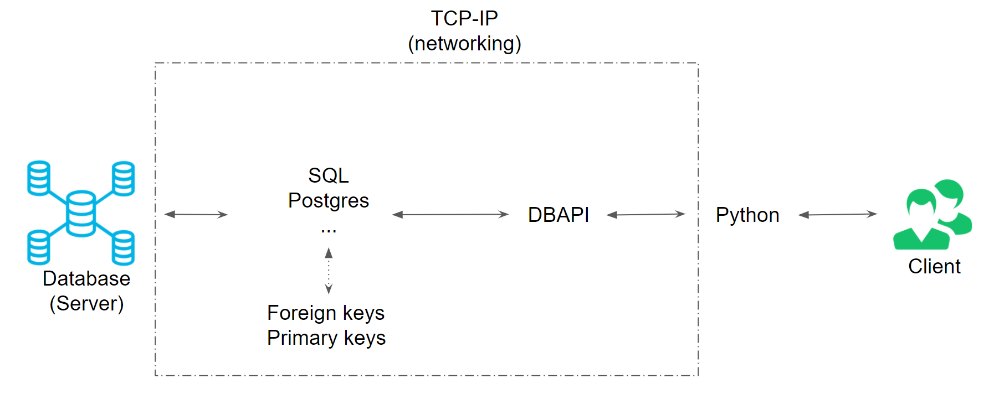
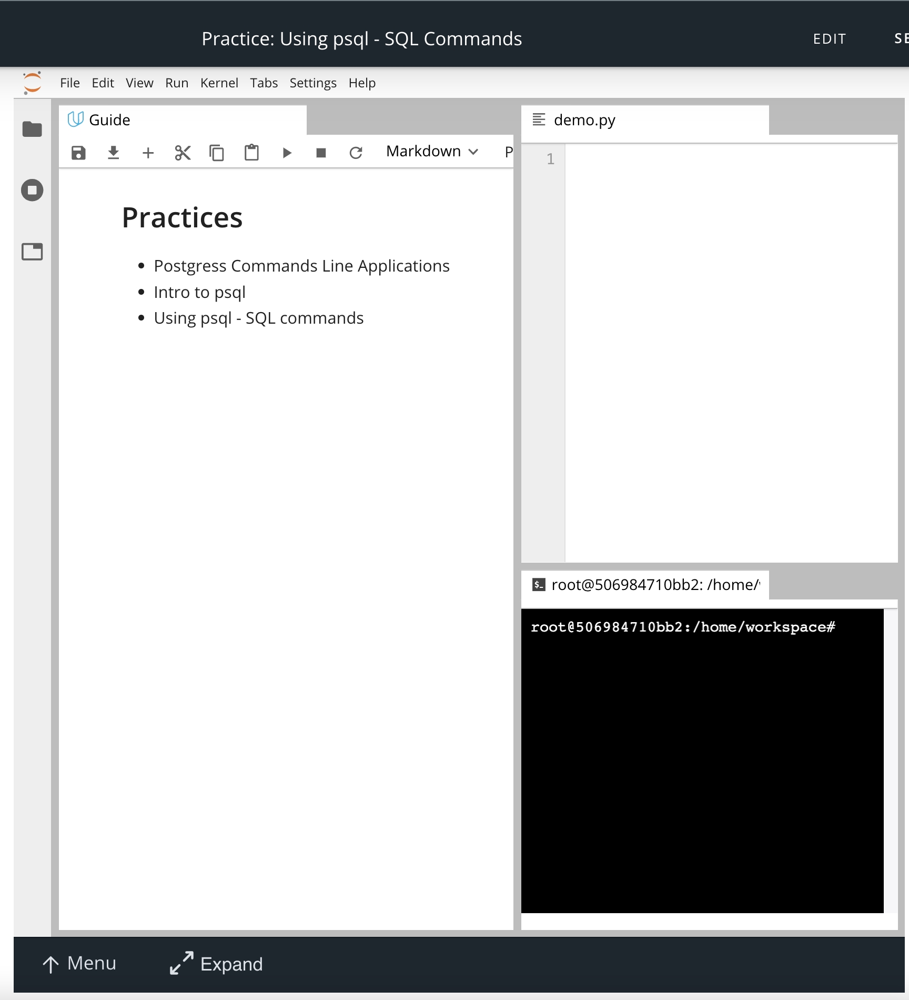

# 2.3.1 단원 개요

## 1. (원격으로) 데이터베이스와 상호 작용하기

- 백엔드 개발자는 웹 애플리케이션의 모델을 조작하고 유지 관리하기 위해 정기적으로 데이터베이스와 상호 작용해야 한다.
- 이 단원에서는 이러한 상호 작용이 어떻게 작동되는지에 대한 기초를 쌓는다.
- 기초를 이해하는 것은 데이터베이스 상호 작용과 관련된 고급 개념을 살펴볼 때 필수적이다.
- 데이터베이스로 작업할 때는 **DBMS(Database Management System, 데이터베이스 관리 시스템)** 를 사용해야 한다.

  > `DBMS`(데이터베이스 관리 시스템)는 데이터베이스와 상호 작용(예: 데이터베이스의 데이터에 액세스하거나 데이터를 수정)할 수 있도록 해주는 소프트웨어이다.

- 시중에는 다양한 데이터베이스 관리 시스템이 있지만, 우리가 사용할 `DBMS`는 [`PostgreSQL`](https://www.postgresql.org/)(또는 줄여서 Postgres)이라고 한다.

 

## 2. `DBAPI` (데이터베이스 애플리케이션 프로그래밍 인터페이스)

- 데이터베이스와의 상호 작용에 대한 기초를 살펴본 후, 다른 언어 또는 웹 서버 프레임워크(예: 파이썬, NodeJS, Ruby on Rails 등)에서 해당 데이터베이스와 상호 작용하는 방법을 이해해야 한다. 이것이 바로 `DBAPI`의 역할이다.

- 이 단원에서는 `DBAPI`의 기초와 함께 `DBAPI`를 사용하여 다른 언어(예: 파이썬)의 데이터베이스와 상호 작용하는 방법을 살펴본다.

 

## 3. `psycopg2`

- 마지막으로, 많이 사용되는 `psycopg2` 라이브러리로 작업하며 파이썬에서 데이터베이스와 상호 작용할 수 있는 경험을 쌓는다.

  > `psycopg2`는 파이썬에서 Postgres 데이터베이스와 상호 작용할 수 있도록 해주는 데이터베이스 어댑터이다.

- 모든 컴포넌트 사이에는 많은 일이 일어난다. 아래 다이어그램을 통해 모든 컴포넌트가 어떻게 연결되어 있는지 알 수 있다.

  

 

## 쿼리 실습

이 과정에서는 다음 플랫폼 중 하나를 사용해 쿼리를 연습할 수 있다.

### 1. (권장) 로컬 ([`Postgres` 설치](https://www.postgresql.org/download/))

- `12.x.x` 이상의 버전을 다운로드해야 한다.
- 로컬에서 실습하면 쿼리 및 데이터베이스 상태를 저장할 수 있어 좋다.

### 2. (권장) 강의실 워크스페이스

- 연습 문제를 풀어 볼 수 있도록 강의실 내에 워크스페이스가 제공된다.
- 워크스페이스에는 필요한 도구와 소프트웨어가 모두 설치되어 있다.
- 현재 강의실 워크스페이스에서는 `Postgres 9.6.x`를 사용하고 있지만, 모든 연습 문제 및 쿼리는 `PostgreSQL 12.x.x` 이상의 버전에서 정상적으로 작동한다.
- 워크스페이스를 사용하면 명령어, 파이썬 코드 및 터미널을 한 곳에서 모두 연습할 수 있으므로 편리하다. (아래의 워크스페이스 스냅샷을 참고)
  
