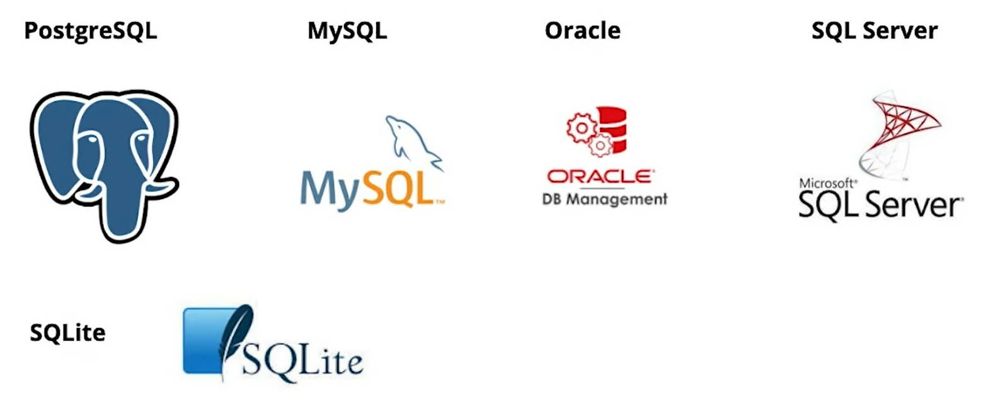
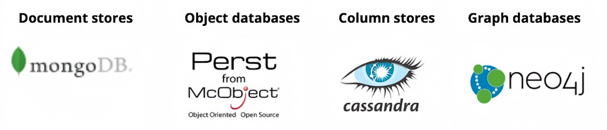

# 2.3.2 관계형 데이터베이스

## 1. 데이터베이스(Database)란?
- **데이터베이스(Database)**: 데이터의 집합 (collection of data)  
- **데이터베이스 시스템(Database System)**: 데이터를 체계적으로 저장·조회·수정하는 시스템

 

## 2. 데이터베이스의 주요 특징
### 1) 지속성(Persistence)
- 한 번 저장된 데이터는 이후에도 접근 가능

### 2) 단일 데이터 출처(Single Source of Truth)
- 여러 사용자가 동시에 접근해도 데이터 일관성 유지

### 3) 다양한 데이터 타입 지원
- 숫자, 문자열, 불리언 등 여러 형태의 데이터를 효율적으로 저장

### 4) 동시성 제어(Concurrency Control)
- 여러 사용자가 동시에 읽기·쓰기 작업을 해도 데이터의 정확성과 일관성 유지

 

## 3. 데이터베이스의 두 가지 큰 분류
### 1) 관계형(Relational) 데이터베이스

- 대표 시스템: PostgreSQL, MySQL, Oracle, SQL Server, SQLite  
- 표(Table) 형태로 데이터 관리  
- 대부분의 웹 애플리케이션에 기본적으로 사용됨  
- 시스템 간의 동작 방식이 유사함 → 하나를 배우면 다른 시스템에도 응용 가능  

### 2) 비관계형(Non-Relational) 데이터베이스

- 예: MongoDB, Cassandra, Neo4j 등  
- 특수한 목적이나 대규모 분산 시스템에서 사용  
- 하지만 기초로는 관계형 DB를 배우는 것이 가장 중요함 

 

## 4. 관계형 데이터베이스의 기본 구조
- 모든 데이터는 테이블(Table)에 저장됨  
- 테이블 구성 요소:
  - **열(Column)**: 데이터의 속성 (예: 이름, 나이, 이메일 등)  
  - **행(Row)**: 실제 데이터 레코드  
- 각 열에는 **데이터 타입(Data Type)** 정의 (문자열, 숫자 등)

 

## 5. 데이터 무결성(Data Integrity)
- 데이터의 **정확성(Accuracy)** 과 **일관성(Consistency)** 을 보장  
- 유지 수단:
  - **제약조건(Constraints)**: 데이터 입력 규칙 설정 (예: NOT NULL, UNIQUE 등)  
  - **트리거(Triggers)**: 특정 동작 시 자동 실행 규칙  

 

## 리소스
- Udacity 무료 강좌: [관계형 데이터베이스 입문](https://www.udacity.com/org/puroomnet/course/intro-to-relational-databases--ud197)  
- 영상: [관계형 데이터베이스 소개](https://www.youtube.com/watch?v=z2kbsG8zsLM)
