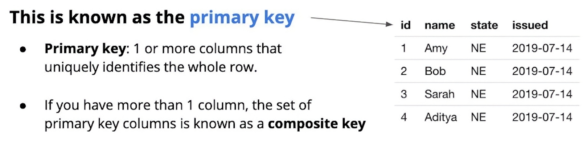

# 2.3.3 기본 키와 외래 키

## 1. 기본 키 (Primary Key)
- **정의**: 테이블 내의 각 행(Row)을 **유일하게 식별**하는 열(Column) 또는 열 집합
- **특징**
  - 모든 행은 고유한 값으로 구분 가능해야 함
  - NULL 값 허용 불가
- **복합 키(Composite Key)**
  - 기본 키가 **여러 열(Column)로 구성**된 경우
  - 여러 열의 조합으로 행을 고유하게 식별
- **예시**
  - 운전자 정보를 담은 테이블에서 `id` 열을 기본 키로 설정
  - `id = 3` → Sarah, NE 주 면허, 발급일: 2019-07-14
  

 

## 2. 외래 키 (Foreign Key)
- **정의**: 다른 테이블의 **기본 키(Primary Key)** 를 참조하는 열
- **목적**: 테이블 간 **관계(Relationship)** 를 표현하고 데이터 연결
- **예시**
  - 차량 테이블에서 `driver_id` 열이 외래 키
  - 차량 `id = 1` (Nissan Altima, 2018) → `driver_id = 3`
  - `driver_id = 3` → Sarah, NE 주 면허, 발급일: 2019-07-14
  
- 외래 키를 통해 **한 테이블의 행이 다른 테이블의 행과 연결**됨

 

## 💡 핵심 요약
| 개념 | 설명 |
|------|------|
| 기본 키 (Primary Key) | 전체 행의 고유 식별자로, 하나 이상의 열을 참조   여러 열이 있는 경우, 기본 키의 열 집합을 복합 키라고 함|
| 외래 키 (Foreign Key) | 다른(외래) 테이블의 기본 키   테이블 간의 관계를 매핑하는 데 사용|
