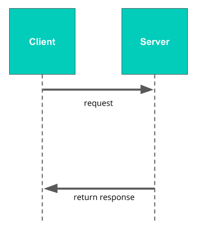
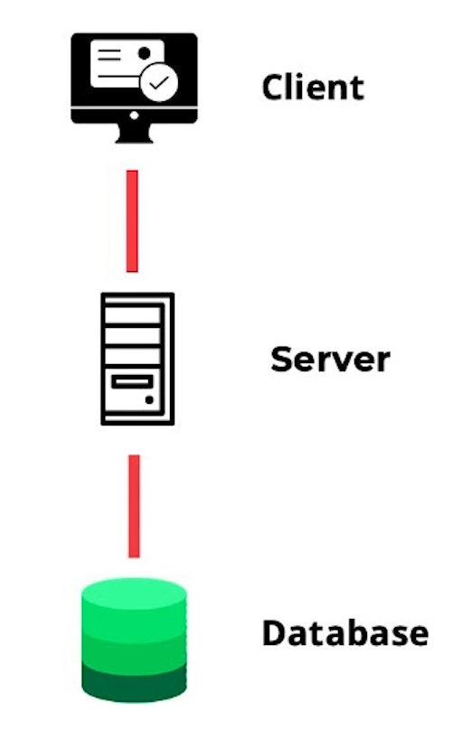

# 2.3.6 클라이언트-서버 모델

데이터베이스 기반 웹 애플리케이션을 구축하려면  
**서버(Server)**, **클라이언트(Client)**, **데이터베이스(Database)** 가 어떻게 상호 작용하는지 이해해야 한다.  
이 모든 것은 **클라이언트-서버 모델(Client-Server Model)** 을 기반으로 작동한다.

<br>

## 1. 클라이언트-서버 모델이란?
**클라이언트-서버 모델**은 네트워크(예: 인터넷)를 통해  
서버가 다수의 클라이언트를 지원하는 구조이다.

| 개념 | 설명 |
|------|------|
| **서버(Server)** | 요청을 받아 처리하고 응답을 반환하는 중앙 집중식 프로그램 |
| **클라이언트(Client)** | 서버에 요청을 보내는 프로그램 (예: 웹 브라우저) |
| **호스트(Host)** | 서버 또는 클라이언트를 실행하는 실제 컴퓨터로, 네트워크를 통해 연결됨 |

<br>

## 2. 요청(Request)과 응답(Response)

### 1) **클라이언트 → 서버:** 요청(Request)을 보냄  
   예: 브라우저가 웹페이지를 요청

### 2) **서버 → 클라이언트:** 응답(Response)을 반환  
   예: 서버가 HTML 데이터를 반환하여 브라우저가 웹페이지를 표시

### 3) **통신 프로토콜(Communication Protocol):**  
   클라이언트와 서버가 요청과 응답을 주고받을 때 사용하는 공통 언어  
   → 통신 방식과 규칙(역할, 순서, 형식 등)을 정의함

<br>

## 3. 데이터베이스와 클라이언트-서버 구조

**관계형 데이터베이스 시스템(PostgreSQL 등)** 역시 클라이언트-서버 모델을 따른다.

| 역할 | 설명 |
|------|------|
| **데이터베이스 서버(DB Server)** | 데이터를 저장하고 관리하며 요청을 처리하는 서버 |
| **데이터베이스 클라이언트(DB Client)** | SQL 쿼리를 통해 데이터베이스에 요청을 보내는 프로그램 |

<br>

## 4. 웹 애플리케이션의 계층 구조

웹 애플리케이션 개발에서는 여러 단계의 클라이언트-서버 관계가 겹쳐진다.



- 라우저(클라이언트) → 웹 서버에 요청
- 웹 서버(서버) → 요청을 처리하기 위해 **데이터베이스(서버)** 에 접근
- 이때 웹 서버는 데이터베이스의 클라이언트 역할을 하게 된다.

<br>

## 5. 정리
| 구분	| 역할 |
|---|---|
| 클라이언트(Client)	| 요청을 보내는 쪽 |
| 서버(Server)	| 요청을 처리하고 응답을 보내는 쪽 |
| 웹 서버(Web Server)	| 브라우저에겐 서버이지만, 데이터베이스에겐 클라이언트 |
| 데이터베이스 서버(DB Server)	| 데이터를 저장하고 요청을 처리하는 서버 |

💬 결국 "요청을 보낼 때는 클라이언트,
요청을 처리할 때는 서버"라고 이해하면 쉽다.

<br>

### 예시 다이어그램
```scss
(1) 사용자가 웹 브라우저로 요청
        ↓
(2) 웹 서버가 요청을 받아 처리
        ↓
(3) 필요한 경우 DB 서버에 데이터 요청
        ↓
(4) DB 서버가 응답 반환
        ↓
(5) 웹 서버가 결과를 클라이언트에 전달
```

### 참고 개념
- 통신 프로토콜: 클라이언트-서버 간의 데이터 교환 규칙
- 호스트: 서버 또는 클라이언트를 실행하는 컴퓨터
- 데이터베이스 클라이언트: psql, PgAdmin, 또는 웹 서버 자체

### 요약
- 서버는 요청을 처리하는 프로그램
- 클라이언트는 요청을 보내는 프로그램
- 웹 서버는 두 가지 역할을 모두 수행 가능
- 관계형 데이터베이스(Postgres 등)는 클라이언트-서버 모델을 따름