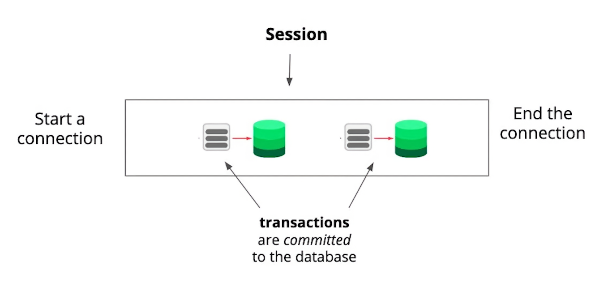

# 2.3.9 TCP/IP의 연결 및 세션

## 개요
TCP/IP는 **인터넷 통신의 핵심 프로토콜 집합(Suite)** 이다.  
데이터베이스(PostgreSQL 등)와 클라이언트(예: 애플리케이션) 간의 통신 역시 이 프로토콜 위에서 이루어진다.

TCP/IP는 **“연결 기반(connection-based)”** 프로토콜로,  
모든 데이터 송수신은 반드시 **연결(Connection)** 을 맺은 뒤에만 가능하다.

 

## 연결(Connection)과 세션(Session)

| 개념 | 설명 |
|------|------|
| **연결(Connection)** | 클라이언트와 서버 간의 통신 통로.  TCP/IP에서는 통신을 시작하기 전에 반드시 연결을 설정해야 함 |
| **세션(Session)** | 연결이 유지되는 기간 동안의 상호작용 전체를 의미.  연결이 시작되면 세션이 시작되고, 연결이 종료되면 세션도 끝남 |

### 예시
1) 사용자가 `psql` 명령어로 Postgres 서버에 접속  
→ **연결 시작 (세션 시작)**  

2) SQL 명령어 여러 개 실행 (INSERT, UPDATE, SELECT 등)  
→ **트랜잭션들이 세션 안에서 수행됨**  

3) `\q` 명령어나 프로그램 종료  
→ **연결 종료 (세션 종료)**  

 

## 세션 안에서의 트랜잭션(Transactions)

- 한 세션(Session)은 여러 개의 **트랜잭션(Transaction)** 을 포함할 수 있다.  
- 각 트랜잭션은 **데이터베이스 변경 작업**(삽입, 수정, 삭제 등)을 수행하고  
  **커밋(Commit)** 또는 **롤백(Rollback)** 으로 마무리된다.  

> 즉, "세션(Session)"은 여러 "트랜잭션"이 일어나는 **시간적 컨테이너** 이다.

 

## TCP/IP의 핵심 특성

| 항목 | 설명 |
|------|------|
| **연결 기반(Connection-oriented)** | 통신 시작 전 연결 설정, 통신 종료 시 연결 해제 필요 |
| **데이터 순서 보장(Order)** | 전송한 데이터는 수신 측에서 같은 순서로 도착 |
| **에러 검출 및 재전송(Reliability)** | 손상되거나 분실된 패킷은 재전송 (Retransmission) |
| **흐름 제어 및 혼잡 제어(Flow & Congestion Control)** | 네트워크 과부하를 방지하고 데이터 전송 속도를 제어 |

이 덕분에 TCP는 **안정적이고 신뢰성 있는 통신**을 제공한다.  
다만, 이러한 안정성을 보장하기 위해 **지연(latency)** 이 발생할 수 있다.

 

## 참고: UDP (User Datagram Protocol)

| 비교 항목 | **TCP** | **UDP** |
|------------|-----------|-----------|
| **연결 방식** | 연결 기반 (Connection-based) | 비연결 (Connectionless) |
| **신뢰성** | 손실 시 재전송, 순서 보장 | 손실 가능, 순서 보장 X |
| **속도** | 느림 (오버헤드 높음) | 빠름 (오버헤드 적음) |
| **사용 예시** | 웹, 이메일, 데이터베이스 통신 | 실시간 스트리밍, VoIP, 게임 |

> **비유로 이해하기**
> - **TCP**: “도로를 깔고 트럭으로 소포를 배달하는 것”  
>   → 안전하지만 준비에 시간이 걸림  
> - **UDP**: “비둘기로 편지를 보내는 것”  
>   → 빠르지만 도착을 보장할 수 없음  

 

## 핵심 정리
- **TCP/IP**는 네트워크 통신의 표준 프로토콜이며, **연결 기반 프로토콜**이다.  
- 통신은 반드시 **연결(Connect)** → **통신(Transmit)** → **연결 해제(Close)** 순으로 진행된다.  
- **세션(Session)** 은 연결이 유지되는 동안의 상호작용 전체를 의미한다.  
- 세션 안에서는 여러 **트랜잭션(Transaction)** 이 수행되고, 각 트랜잭션은 DB에 실제 변화를 일으킨다.  
- **TCP는 신뢰성**, **UDP는 속도**에 초점을 맞춘다.  
  (→ 안정성 중시: TCP / 실시간 전송 중시: UDP)

### **요약**
> TCP/IP는 “대화하려면 먼저 연결하고, 끝나면 끊는다”는 규칙을 가진 통신 프로토콜이다.  
> 연결이 유지되는 동안의 대화(데이터 주고받기)가 세션(Session)이며,  
> 그 안에서 일어나는 구체적인 작업 단위가 트랜잭션(Transaction)이다.